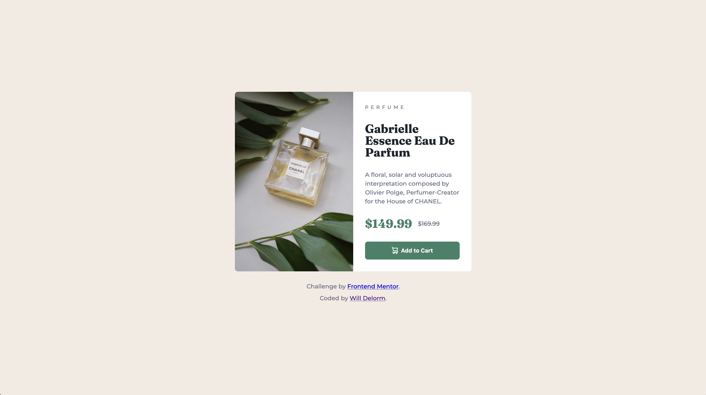

# Frontend Mentor - Product preview card component solution

This is a solution to the [Product preview card component challenge on Frontend Mentor](https://www.frontendmentor.io/challenges/product-preview-card-component-GO7UmttRfa).

## Table of contents

- [Overview](#overview)
  - [The challenge](#the-challenge)
  - [Screenshot](#screenshot)
  - [Links](#links)
- [My process](#my-process)
  - [Built with](#built-with)
  - [What I learned](#what-i-learned)
  - [Continued development](#continued-development)
  - [Useful resources](#useful-resources)
- [Author](#author)

## Overview

### The challenge

Your challenge is to build out this product preview card component and get it looking as close to the design as possible.

You can use any tools you like to help you complete the challenge. So if you've got something you'd like to practice, feel free to give it a go.

Your users should be able to:

- View the optimal layout depending on their device's screen size
- See hover and focus states for interactive elements

### Screenshot



### Links

- Solution URL: [Github](https://github.com/willdelorm/product-preview-card)
- Live Site URL: [Github Pages](https://willdelorm.github.io/product-preview-card/)

## My process

### Built with

- Semantic HTML5 markup
- Mobile-first workflow
- [Sass](https://sass-lang.com/) - CSS preprocessor

### What I learned

#### Sass

I refreshed my knowledge of Sass on this project. Usually, I write plain vanilla CSS, so I added on the challenge of reacquainting myself with a preprocessing language.

One feature I like is the simpler variable system. Sass's version of variables is much cleaner to create and use. It's also more readable to me.

The ability to nest selectors also makes for a cleaner experience. I found that I could use fewer class name if the elements were nested within a class selector:

```css
.card {
  img {
    max-inline-size: 100%;
    block-size: auto;
  }
}
```

Since `.card` is a specific class, `img` elements are only affected if they are withing a `.card` element.

#### CSS

It's so easy to get stuck in our ways. Though I am more comfortable using `px` for sizing, using relative units is better for the varying device sizes available these days. Similarly, replacing `width` and `height` with `inline-size` and `block-size` is a good way to prevent things from getting weird when the writing-mode is different from what I expect.

### Continued development

I plan to continue using relative units and other modern properties of CSS styling.

### Useful resources

- [web.dev](https://web.dev/learn/design) - I kept this resource open while developing so I could quickly reference responsive design practices. Definitely going to keep peeking at this until I'm really comfortable.

## Author

- Website - [Will Delorm](https://willdelorm.com)
- Frontend Mentor - [@willdelorm](https://www.frontendmentor.io/profile/willdelorm)
